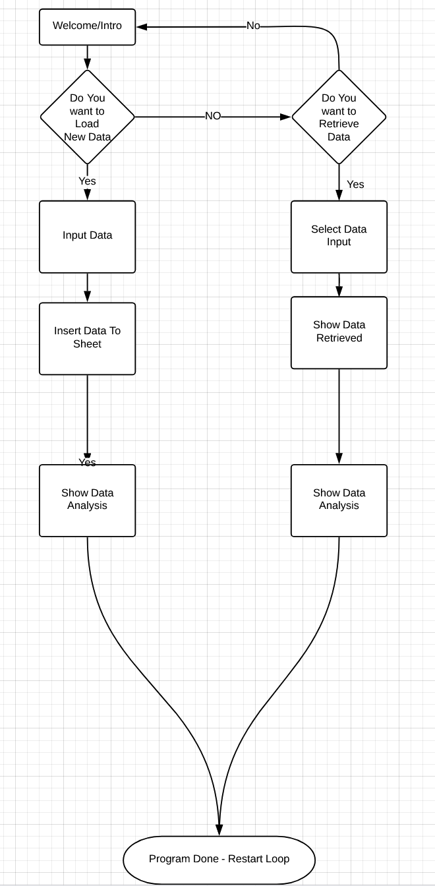
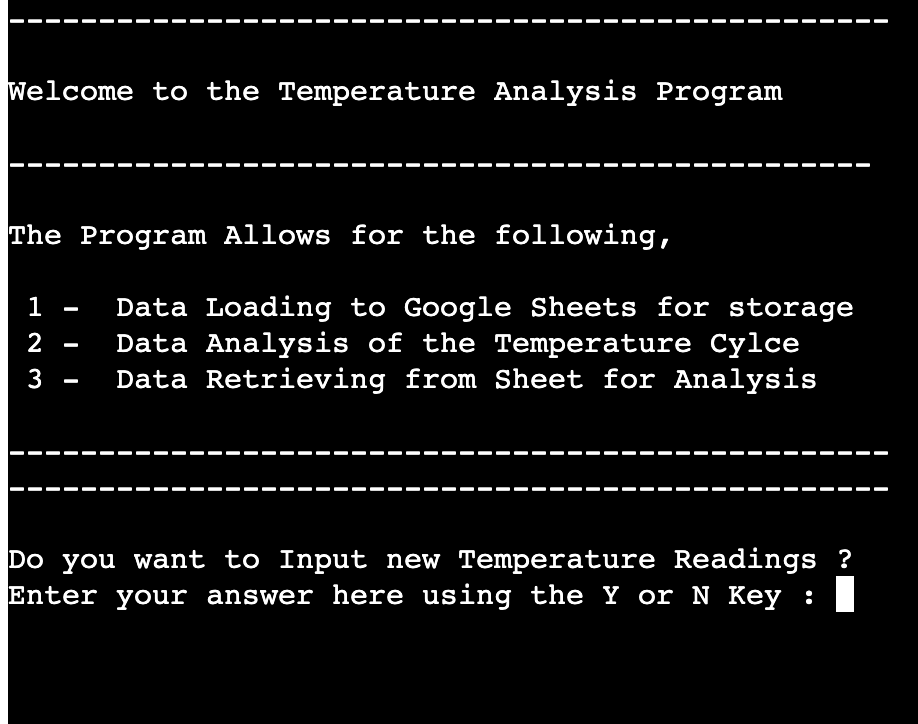
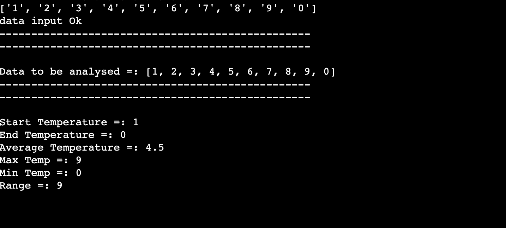
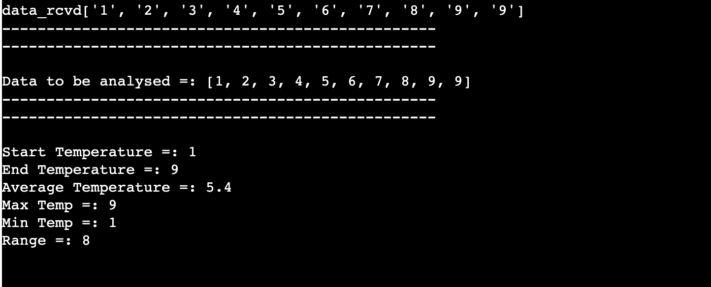
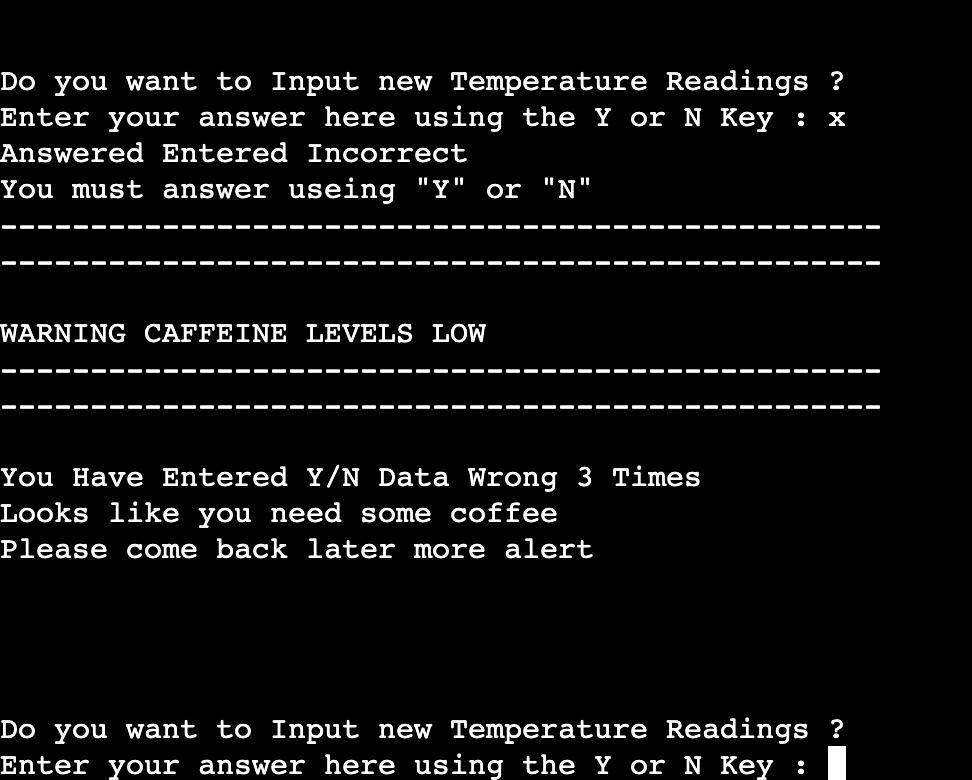
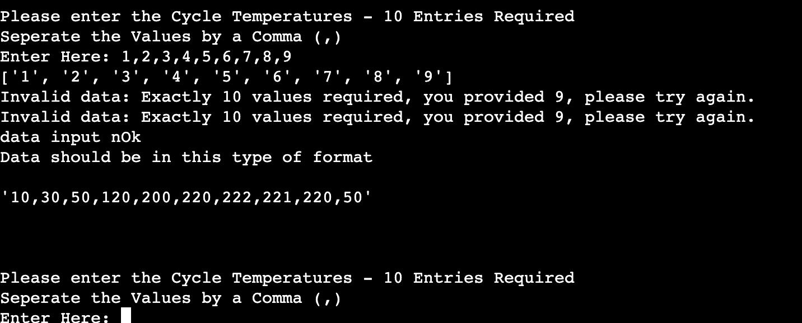
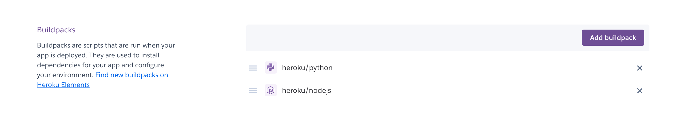
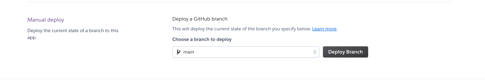
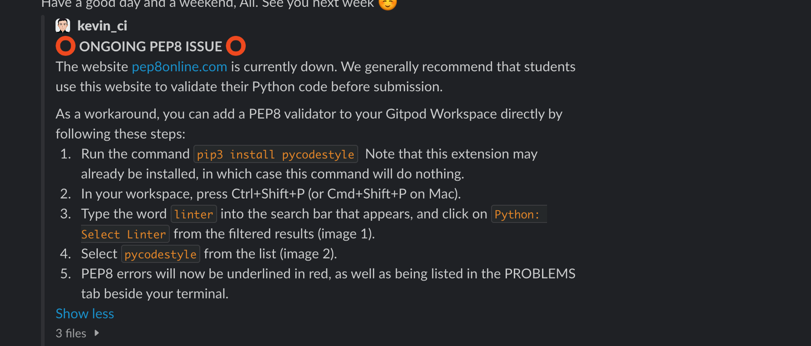
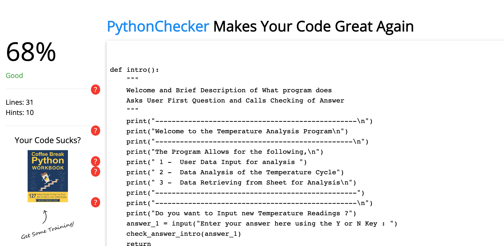

# Temperature Analysis Program

In my current Job as a controls systeme engineer we specialise in the thermal welding of plastics. I used this background as my inspiration for the idea for the project. After every Cycle of Temperature increase to perform welding data points are to be taken at set timed intervals. These data points can then be loaded into this Temperature Analysis Program for further analysis. 

 
 

The project will allow for the user to,

- Input data -  10 temperature values that are to be processed with calculations and the data to be stored in google Sheet
- Retrieve Data from a google sheets by calling a specific index number.
- View data summary of requested data.

 
 

Some examples of the data that can be input, 

- 10,30,50,120,200,220,222,221,220,50
- 40,90,110,120,200,225,222,221,220,20
- 25,30,50,120,200,220,222,221,220,50

 
 

Sample of the Result the user can expect from the data analysis

- Start Temperature : 10
- End Temperature : 50
- Average : 134.3
- Max Temp : 222
- Min Temp :10
- Range : 212
  
 
 

## Program Flow Chart 

### Program Flow can be seen in Flow Chart Below
 

  

 
 

## Program Questions / Queries - Screen Step Through 
 

###  Step 1 : Intro Message 
 

  

 

- The intro gives the user a brief description of what the program does and what they can expect

- Then the User is prompted with the first quesiton they can answer using the Y or N keys
 
 

### Step 2 : User Selects "Y"
 

  

- The User selects Y  and wants to input new Temperature Readings 
- User is then prompted to input data - with some info as to what is required.
 
 

### Step 3 : Succesful Data Entry from User 
 

  

- The User inputs the correct the data - Program informs them Data Ok.
- Program stores data in Sheet.
- Program runs Data analysis of input data and show input.
 
 

### Step 4 : Program Begins Loop Again 
 

  

- Programs Restarts without the long intro message 
 
 

### Step 5 : User Selects "N" 
 

  

- When user answers "N" The program then asks them to they want to retrieve data for Google Spread Sheets
 
 

### Step 6 : User Selects "Y" to Retrieve Question
 

  

- User is prompted to select an index value to retireve data options are 1-10 
 
 

### Step 7 : Data Gets Retrieved and Programs Gives Data Anaylsis
 

  

- Once the Data Gets Retrieved the Programs Gives Data Anaylsis and Program Agains loops back to Start
 
 

## Error Input Handling 
 

## Error Inputs Y or N

  

- If user inputs Wrong data to the Y or N Questions they get the message,
  "You have entered incorrect data - Please Enter Y or N "

- After Inputting wrong data wrong 3 times User gets a Low Caffiene Level Warning and is advised to 
  top up caffiene levels and come back later whilst more alert. 
 
 

## Error Inputs Temperature Values - Data Type 

  

- Example If user inputs Wrong data aka String instead of Int
 
 

## Error Inputs Temperature Values - Incorrect Amount of Values 

  

- Example If user inputs 9 values by mistake instead of 10
 
 
 

## Deployment - Heroku 

For deployment of this project we used the Heroku platform. Heroku is a platform as a service (PaaS) that enables developers to build, run, and operate applications entirely in the cloud.
 

### Step 1 - Adding Build Packages 

  

- Python Package 
- Node JS 
 
 

### Step 2 - Manual Deployment 

  

- Select program as git hub and link git hub account 
- Select Temperatures analysis program
- Go to Manual Deplay and Build package 
 
 

## Testing & Validation   
 

- Validator recommend to use was down at the time of validation occurring. 
- Students were advised to perform this work around. 
- These steps were carried out as per instructions in git hub enviroment. 

  

 
 

- Also Validated code on other validators - code came bakc as "Good" with some white space removal hints. 

  

 
 

### Technical assitance credits 

Credits List

 
 

- Credit 1 - Info used for working with gSpread

- Link 1 -  https://docs.gspread.org/en/latest/user-guide.html

 
 

- Credit 2 - Info for converting list data type to all integers

- Link 2 -  https://www.geeksforgeeks.org/python-converting-all-strings-in-list-to-integers/

 
 

- Credit 3 - Copied Code used for Switch/Case Function in programs 

 

     switch(lang):
 

    if lang == "JavaScript":

 

        return "You can become a web developer."
    elif lang == "PHP":

 
       return "You can become a backend developer."

 

- Link 3 -  https://www.freecodecamp.org/news/python-switch-statement-switch-case-example/

 
 

- Credit 4 - Copied Code used to insert data to Sheet  - "sheet1.update("A8:C8", [["Texas", 5261485, 5261485]]" 

 

- Link 4 - https://www.codeforests.com/2020/11/22/gspread-read-write-google-sheet/

 
 

### Inspitation Assistance for applications

- HTE Emerson Technology applications 

 
 

### Other mentions

Special thanks for Samantha Dartnall for her assistance and guidance throughout the project. 

-----
End

