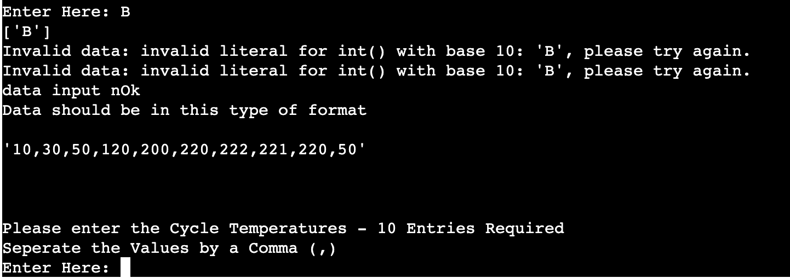

# Temperature Analysis Program

In my current Job as a controls systeme engineer we specialise in the thermal welding of plastics. I used this background as my inspiration for the idea for the project. After every Cycle of Temperature increase to perform welding data points are to be taken at set timed intervals. These data points can then be loaded into this Temperature Analysis Program for further analysis. 

 
 

The project will allow for the user to,

- Input data -  10 temperature values that are to be processed with calculations and the data to be stored in google Sheet
- Retrieve Data from a google sheets by calling a specific index number.
- View data summary of requested data.

 
 

Some examples of the data that can be input, 

- 10,30,50,120,200,220,222,221,220,50
- 40,90,110,120,200,225,222,221,220,20
- 25,30,50,120,200,220,222,221,220,50

 
 

Sample of the Result the user can expect from the data analysis

- Start Temperature : 10
- End Temperature : 50
- Average : 134.3
- Max Temp : 222
- Min Temp :10
- Range : 212
  
 
 

## Program Flow Chart 

### Program Flow can be seen in Flow Chart Below
 

  

 
 

## Program Questions / Queries - Screen Step Through 
 

###  Step 1 : Intro Message 
 

  

 

- The intro gives the user a brief description of what the program does and what they can expect

- Then the User is prompted with the first quesiton they can answer using the Y or N keys
 
 

### Step 2 : User Selects "Y"
 

  

- The User selects Y  and wants to input new Temperature Readings 
- User is then prompted to input data - with some info as to what is required.
 
 

### Step 3 : Succesful Data Entry from User 
 

  

- The User inputs the correct the data - Program informs them Data Ok.
- Program stores data in Sheet.
- Program runs Data analysis of input data and show input.
 
 

### Step 4 : Program Begins Loop Again 
 

  

- Programs Restarts without the long intro message 
 
 

### Step 5 : User Selects "N" 
 

  

- When user answers "N" The program then asks them to they want to retrieve data for Google Spread Sheets
 
 

### Step 6 : User Selects "Y" to Retrieve Question
 

  

- User is prompted to select an index value to retireve data options are 1-10 
 
 

### Step 7 : Data Gets Retrieved and Programs Gives Data Anaylsis
 

  

- Once the Data Gets Retrieved the Programs Gives Data Anaylsis and Program Agains loops back to Start
 
 

## Error Input Handling 
 

## Error Inputs Y or N

  

- If user inputs Wrong data to the Y or N Questions they get the message,
  "You have entered incorrect data - Please Enter Y or N "

- After Inputting wrong data wrong 3 times User gets a Low Caffiene Level Warning and is advised to 
  top up caffiene levels and come back later whilst more alert. 
 
 

## Error Inputs Temperature Values - Data Type 

  

- Example If user inputs Wrong data aka String instead of Int
 
 

## Error Inputs Temperature Values - Incorrect Amount of Values 

  

- Example If user inputs 9 values by mistake instead of 10
 
 
 

## Deployment - Heroku 

For deployment of this project we used the Heroku platform. Heroku is a platform as a service (PaaS) that enables developers to build, run, and operate applications entirely in the cloud.
 

### Step 1 - Adding Build Packages 

  

- Python Package 
- Node JS 
 
 

### Step 2 - Manual Deployment 

  

- Select program as git hub and link git hub account 
- Select Temperatures analysis program
- Go to Manual Deplay and Build package 

## Testing & Validation   

### W3 Validation was carried out - 

  

#### Some major issues Found - Index Page / Lessons Page

Div inside Span  - To create inline blocks on my intro area I used Span functionality then to later stlye the content for this area I enclosed items in the intro area in Divs.
 Upon Running the W3 Code validator This was flagged up asan error, See Errow Below, 
 "Error: Element "div" not allowed as child of element "span" in this context"
 To rectify this I need to restructure my Divs and Us the Block/ Inline display funtion to get the items to appear as desired. I learned that images are automatically there own inline block and behave as so. This was throwing me off for a while as I kept trying to define my images as inline block along with  block of text to go along with it but it would not behave as expected. 
 After I realised images act as inline blocks inherently then the process was alot easier to get right. \\

 #### Minor issues 

 Lots of open or not closed HTML Commands such Divs/a/ , spelling mistakes on command such "l1"insead of "li" on some ordered lists.

#### Screen Size Testing 

The Pages where tested at different resulutions via google chrome inspect dev tools toolbar. 
The Viewport set points for media queries where design around the values 800px & 1200px 

#### Browser 

Pages checked on multiple broswers namelt, Chrome, firefox and Microsoft Edge. 

#### CSS Valicator 

  

The following Errors where present when the CSS validator was ran. They have all been resovled. 

## Credits 

The following websites/orgs where extremely helpful in assiting with my understanding of what is requried and inspiration for what is the standard for this type of website.

### Technical assitance credits 

W3 School
W3 Code validator 
Stack Over flow 
Kevin Powell - Youtube Channel 

### Inspitation Assistance credits and allocation of some images 

        alsaa tennis club - website 
        euroschooloftennis -  website - for text content and some images. 

### Stock images 

      Pxhere.com 

### Other mentions

Special thanks for Samantha Dartnall for her assistance and guidance throughut the project. 

-----
Happy coding!

Credits List

https://docs.gspread.org/en/latest/user-guide.html

https://www.geeksforgeeks.org/python-converting-all-strings-in-list-to-integers/

https://www.freecodecamp.org/news/python-switch-statement-switch-case-example/

https://www.w3schools.com/python/ref_stat_stdev.asp#:~:text=stdev()%20method%20calculates%20the,clustered%20closely%20around%20the%20mean.